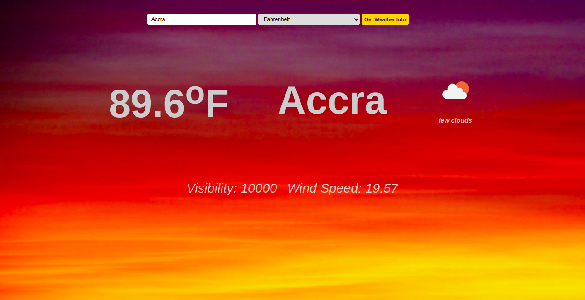

# weather-app
The Weather App enables users to submit their location in a form and get back the weather information.



## Built With

- HTML5
- CSS3
- JavaScript
- Babel
- Webpack

## Live Demo

[Live Demo Link](https://raw.githack.com/Blaise-Shyaka/weather-app/weather-app-features/dist/index.html)

## Getting Started

In order to run locally this project type the following commands over the terminal in Linux or Mac or the Windows cmd console:

```s
$ git clone https://github.com/Blaise-Shyaka/weather-app.git
$ cd weather-app
$ npm install

```

To see the web application in the browser open the `index.html` file inside `dist` folder.

## Authors

👤 **Blaise Pascal Shyaka**

- Github: [@Blaise-Shyaka](https://github.com/Blaise-Shyaka)
- Twitter: [@blaiseshyaka95](https://twitter.com/blaiseshyaka95)
- Linkedin: [linkedin](https://www.linkedin.com/in/blaise-pascal-shyaka)

## 🤝 Contributing

Contributions, issues, and feature requests are welcome!

Feel free to check the [issues page](https://github.com/Blaise-Shyaka/weather-app/issues).

## Show your support

Give a ⭐️ if you like this project!

## 📝 License

This project is [MIT](./LICENSE) licensed.